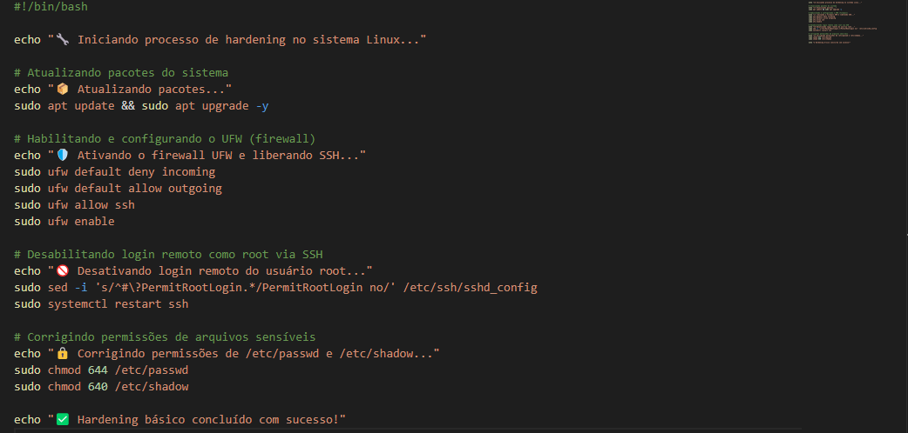
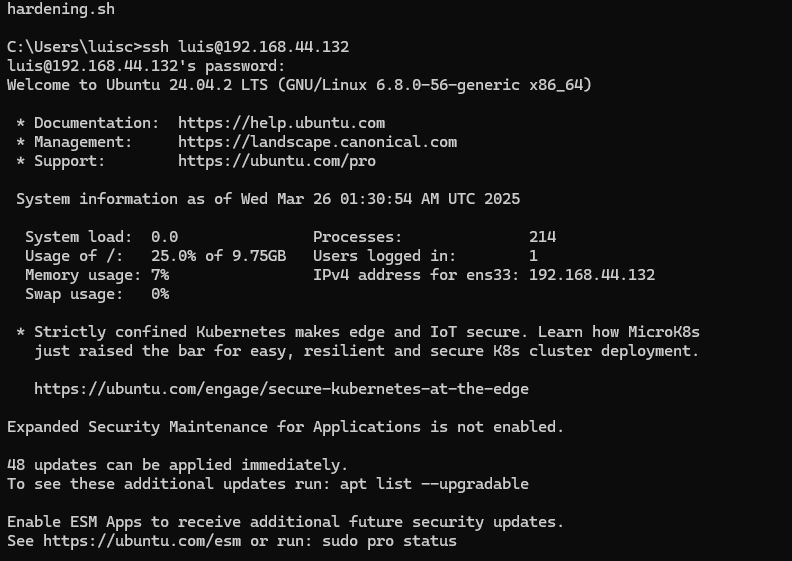
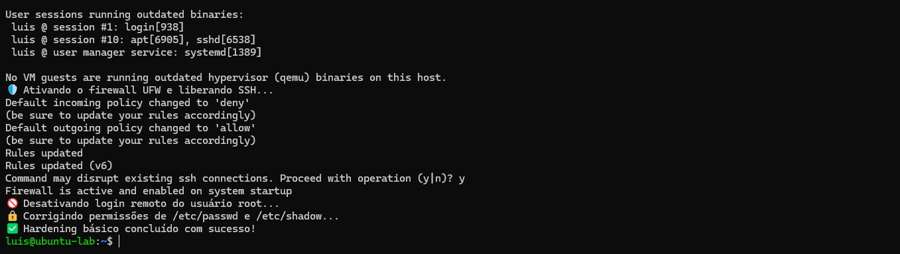

# 🛡️ Secure Linux Baseline – Endurecimento de Segurança para Servidores Ubuntu

Este repositório é uma base prática e didática de **hardening em servidores Linux**, com foco inicial no Ubuntu Server.  
A proposta é fornecer scripts e recursos para aplicar **boas práticas de segurança**, partindo do zero até o mínimo recomendado em ambientes reais.

---

## Conteúdo

- Script de hardening básico (`hardening.sh`)
- Prints de execução real em máquina virtual
- Execução remota via SSH simulando ambiente real
- Expansões futuras para ferramentas como `fail2ban`, `ufw`, `ssh`, etc.

---

## 📌 Finalidade

Este projeto foi construído manualmente, simulando um cenário real de aplicação:

- Instalação manual do Ubuntu Server em VM
- Configuração de rede, teclado e acesso SSH
- Criação de script de automação com foco em segurança
- Execução e validação via terminal remoto

O objetivo é consolidar conhecimentos em **cibersegurança, infraestrutura e shell scripting**, com potencial de aplicação prática imediata.

---

## 🔧 O que o Script Faz

- Atualiza pacotes do sistema
- Ativa e configura o firewall UFW (liberando apenas SSH)
- Desativa login remoto de root via SSH
- Corrige permissões sensíveis dos arquivos `/etc/passwd` e `/etc/shadow`
- Apresenta mensagens de sucesso/falha durante execução

---

## 🖼️ Demonstrações

### 📄 Código do Script

---

### 🔐 Conexão SSH na máquina virtual

---

### ✅ Execução concluída com sucesso

---
